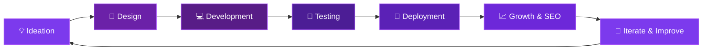

<!-- ═══════════════════════════════════════════════════════════════════════════════
     ✦  FINPIXEL INDIA — GitHub Profile README
     ✦  Founder: Ashish Singh
     ✦  "Defining every pixel with precision"
     ═══════════════════════════════════════════════════════════════════════════════ -->

<div align="center">

<!-- ───────────── ANIMATED HEADER BANNER ───────────── -->


<!-- ───────────── CELESTIAL GLOW AURA ───────────── -->


<!-- ───────────── TYPING ANIMATION ───────────── -->

<a href="https://git.io/typing-svg">
  
</a>

<br/>

<!-- ───────────── PROFILE BADGES ───────────── -->


&nbsp;
<a href="https://github.com/finpixelindia?tab=followers">
  
</a>
&nbsp;

&nbsp;
<a href="https://linktr.ee/finpixelindia">
  
</a>

<br/><br/>

<!-- ───────────── ANIMATED DIVIDER ───────────── -->


</div>

<!-- ═══════════════════════════════════════════════════════════════════════════════ -->

<!-- ───────────── ABOUT FINPIXEL INDIA ───────────── -->

<div align="center">

## 🏢 About Finpixel India

<br/>

<a href="https://readme-typing-svg.demolab.com">
  
</a>

<br/>

</div>

<div align="center">

> 🚀 **Finpixel India** is a cutting-edge **web development & digital marketing agency** founded by **Ashish Singh**.
> We specialize in building **world-class websites**, **3D animations**, and **high-converting digital experiences**
> that help businesses thrive in the digital universe.

<br/>

<table>
<tr>
<td align="center" width="25%">
<br/><br/>
<sub>Custom-built premium sites</sub>
</td>
<td align="center" width="25%">
<br/><br/>
<sub>Worldwide satisfied clients</sub>
</td>
<td align="center" width="25%">
<br/><br/>
<sub>5-star rated services</sub>
</td>
<td align="center" width="25%">
<br/><br/>
<sub>Always here for you</sub>
</td>
</tr>
</table>

<br/>

</div>

<div align="center">

<!-- ✦ Celestial Divider ✦ -->


</div>

<br/>

<div align="center">

##  &nbsp;Hey there, I'm **Ashish Singh**

### 🚀 Founder — **Finpixel India**

<br/>

<a href="https://readme-typing-svg.demolab.com">
  
</a>

</div>

<br/>

<table align="center" border="0" cellspacing="0" cellpadding="0">
<tr>
<td width="50%" valign="top">

### 🧑‍💻 About Me

```yaml
Name:       Ashish Singh
Role:       Founder
Company:    Finpixel India
Mission:    Defining every pixel with precision
Location:   India 🇮🇳
Email:      finpixelindia@gmail.com
```

- 🔭 Building **Finpixel India** — a premier web development & social media marketing agency
- 🌟 We craft **world-class websites** with **3D animations**, responsive designs & premium aesthetics
- 📈 Helping businesses **dominate social media** & maximize their digital presence
- 🎨 Obsessed with **pixel-perfect**, immersive user experiences
- 🌐 Creating **engaging, interactive** web experiences that convert visitors into customers
- ⚡ Fun fact: I believe **every pixel tells a story**

</td>
<td width="50%" valign="top" align="center">


<br/><br/>

<a href="mailto:finpixelindia@gmail.com">
  
</a>

</td>
</tr>
</table>

<br/>

<div align="center">

<!-- ✦ Celestial Divider ✦ -->


</div>

<br/>

<!-- ═══════════════════════════════════════════════════════════════════════════════ -->

<div align="center">

##  &nbsp;What We Do at Finpixel India

<br/>

<a href="https://readme-typing-svg.demolab.com">
  
</a>

</div>

<br/>

<div align="center">
<table>
<tr>
<td align="center" width="33%">
<br/>
<br/><br/>
<b>🌐 Web Development</b><br/><br/>
<sub>Stunning, responsive & 3D-animated websites that leave lasting impressions. We build fast, SEO-friendly, and conversion-optimized sites using cutting-edge tech.</sub><br/><br/>
</td>
<td align="center" width="33%">
<br/>
<br/><br/>
<b>📱 Social Media Marketing</b><br/><br/>
<sub>Strategic growth campaigns that boost engagement & drive conversions. From content creation to paid ads, we make your brand go viral.</sub><br/><br/>
</td>
<td align="center" width="33%">
<br/>
<br/><br/>
<b>🎨 UI/UX Design</b><br/><br/>
<sub>World-class professional designs with pixel-perfect precision. Every interface is crafted to delight users and drive business results.</sub><br/><br/>
</td>
</tr>
</table>
</div>

<br/>

<!-- ───────────── DETAILED SERVICES BREAKDOWN ───────────── -->

<div align="center">

<details>
<summary><b>🔥 Click to Explore Our Full Service Stack</b></summary>

<br/>

| Service | Description | Key Deliverables |
|:-------:|:-----------:|:----------------:|
| 🖥️ **Custom Websites** | Tailor-made websites built from scratch | Responsive, Fast, SEO-Ready |
| 🎞️ **3D Animations** | Immersive 3D elements & interactions | Three.js, WebGL, GSAP |
| 📊 **SMM Strategy** | Data-driven social media campaigns | Content Calendar, Analytics |
| 🎯 **Brand Identity** | Complete visual branding packages | Logo, Colors, Typography |
| 📈 **Growth Hacking** | Rapid audience & engagement growth | Paid Ads, Organic Growth |
| 🛒 **E-Commerce** | Online stores that sell | Payment Integration, UX |
| 🔍 **SEO Optimization** | Rank higher on search engines | On-Page, Technical SEO |
| 📱 **Mobile-First Design** | Perfectly responsive across devices | PWA, Mobile Optimization |

<br/>

</details>

</div>

<br/>

<div align="center">

<!-- ✦ Celestial Divider ✦ -->


</div>

<br/>

<!-- ═══════════════════════════════════════════════════════════════════════════════ -->

<div align="center">

## 🛠️ Tech Arsenal & Expertise

<br/>

<a href="https://readme-typing-svg.demolab.com">
  
</a>

<br/><br/>

<!-- ROW 1 — Frontend Core -->


<br/><br/>

<!-- ROW 2 — Styling & Animation -->


<br/><br/>

<!-- ROW 3 — Backend & Database -->


<br/><br/>

<!-- ROW 4 — Tools & Platforms -->


<br/><br/>

<!-- EXTRA DETAILED BADGES -->


</div>

<br/>

<div align="center">

<!-- ✦ Celestial Divider ✦ -->


</div>

<br/>

<!-- ═══════════════════════════════════════════════════════════════════════════════ -->

<div align="center">

##  &nbsp;My Development Workflow

<br/>



</div>

<br/>

<div align="center">

<!-- ✦ Celestial Divider ✦ -->


</div>

<br/>

<!-- ═══════════════════════════════════════════════════════════════════════════════ -->

<!-- ═══════════════ ✦ WEB DEVELOPMENT FEATURES ✦ ═══════════════ -->

<div align="center">

## 🌐 Web Development Features We Deliver

<br/>

<a href="https://readme-typing-svg.demolab.com">
  
</a>

<br/><br/>

<table>
<tr>
<td align="center" width="25%">
<br/>
<br/><br/>
<sub><b>SEO Optimization</b><br/>On-page SEO, meta tags, schema<br/>markup, sitemap & robots.txt<br/>for top Google rankings</sub><br/><br/>
</td>
<td align="center" width="25%">
<br/>
<br/><br/>
<sub><b>SSL Certificate</b><br/>HTTPS encryption, secure<br/>data transfer & trust badges<br/>for complete security</sub><br/><br/>
</td>
<td align="center" width="25%">
<br/>
<br/><br/>
<sub><b>Lightning Speed</b><br/>90+ PageSpeed score, lazy<br/>loading, CDN & optimized<br/>assets for instant loads</sub><br/><br/>
</td>
<td align="center" width="25%">
<br/>
<br/><br/>
<sub><b>Fully Responsive</b><br/>Pixel-perfect on mobile,<br/>tablet & desktop with<br/>adaptive layouts</sub><br/><br/>
</td>
</tr>
<tr>
<td align="center" width="25%">
<br/>
<br/><br/>
<sub><b>Premium Hosting</b><br/>Cloud hosting with 99.9%<br/>uptime, auto-backups<br/>& global CDN</sub><br/><br/>
</td>
<td align="center" width="25%">
<br/>
<br/><br/>
<sub><b>Premium UI/UX</b><br/>Stunning interfaces with<br/>3D animations, micro-<br/>interactions & GSAP effects</sub><br/><br/>
</td>
<td align="center" width="25%">
<br/>
<br/><br/>
<sub><b>Analytics Setup</b><br/>Google Analytics, Search<br/>Console & heatmaps for<br/>data-driven decisions</sub><br/><br/>
</td>
<td align="center" width="25%">
<br/>
<br/><br/>
<sub><b>Security Hardened</b><br/>Firewall, DDoS protection,<br/>malware scanning & secure<br/>authentication</sub><br/><br/>
</td>
</tr>
<tr>
<td align="center" width="25%">
<br/>
<br/><br/>
<sub><b>Domain & DNS</b><br/>Custom domain setup,<br/>DNS configuration &<br/>email routing</sub><br/><br/>
</td>
<td align="center" width="25%">
<br/>
<br/><br/>
<sub><b>Payment Integration</b><br/>Stripe, Razorpay, PayPal<br/>& UPI gateway setup<br/>for e-commerce</sub><br/><br/>
</td>
<td align="center" width="25%">
<br/>
<br/><br/>
<sub><b>CMS Integration</b><br/>WordPress, headless CMS<br/>or custom admin panels<br/>for easy content management</sub><br/><br/>
</td>
<td align="center" width="25%">
<br/>
<br/><br/>
<sub><b>Auto Deployment</b><br/>Git-based CI/CD pipelines,<br/>auto builds & zero-downtime<br/>deployments</sub><br/><br/>
</td>
</tr>
</table>

<br/>

<a href="https://readme-typing-svg.demolab.com">
  
</a>

<br/>

</div>

<br/>

<!-- ═══════════════════════════════════════════════════════════════════════════════ -->

<div align="center">

## 💼 Why Choose Finpixel India?

</div>

<br/>

<div align="center">
<table>
<tr>
<td align="center" width="25%">
<br/>
<br/><br/>
<b>🎯 Pixel Perfect</b><br/>
<sub>Every design crafted<br/>with surgical precision.<br/>Zero compromise on quality.</sub><br/><br/>
</td>
<td align="center" width="25%">
<br/>
<br/><br/>
<b>⚡ Lightning Fast</b><br/>
<sub>Optimized performance<br/>& blazing load times.<br/>90+ PageSpeed score.</sub><br/><br/>
</td>
<td align="center" width="25%">
<br/>
<br/><br/>
<b>🌍 Global Standard</b><br/>
<sub>World-class quality<br/>& modern aesthetics.<br/>International best practices.</sub><br/><br/>
</td>
<td align="center" width="25%">
<br/>
<br/><br/>
<b>📈 Growth Driven</b><br/>
<sub>Results-oriented<br/>marketing strategies.<br/>Data-backed decisions.</sub><br/><br/>
</td>
</tr>
</table>
</div>

<br/>

<!-- ───────────── CLIENT PROCESS ───────────── -->

<div align="center">

### 🔄 Our Process

<br/>

<table>
<tr>
<td align="center">
<h3>1️⃣</h3>
<b>Discovery</b><br/>
<sub>Understanding your<br/>vision & goals</sub>
</td>
<td align="center">
<h3>➜</h3>
</td>
<td align="center">
<h3>2️⃣</h3>
<b>Strategy</b><br/>
<sub>Planning the perfect<br/>digital roadmap</sub>
</td>
<td align="center">
<h3>➜</h3>
</td>
<td align="center">
<h3>3️⃣</h3>
<b>Design</b><br/>
<sub>Crafting stunning<br/>visual experiences</sub>
</td>
<td align="center">
<h3>➜</h3>
</td>
<td align="center">
<h3>4️⃣</h3>
<b>Develop</b><br/>
<sub>Building with<br/>cutting-edge tech</sub>
</td>
<td align="center">
<h3>➜</h3>
</td>
<td align="center">
<h3>5️⃣</h3>
<b>Launch</b><br/>
<sub>Deploying &<br/>going live 🚀</sub>
</td>
</tr>
</table>

</div>

<br/>

<div align="center">

<!-- ✦ Celestial Divider ✦ -->


</div>

<br/>

<!-- ═══════════════════════════════════════════════════════════════════════════════ -->

<div align="center">

## 📈 This Week's Coding Stats

<br/>

<!--START_SECTION:waka-->
```text
HTML         ████████████████░░░░░   35.6%
CSS          ███████████░░░░░░░░░░   25.2%
JavaScript   █████████░░░░░░░░░░░░   20.8%
React/JSX    ████░░░░░░░░░░░░░░░░░   10.1%
TypeScript   ██░░░░░░░░░░░░░░░░░░░    5.4%
Other        █░░░░░░░░░░░░░░░░░░░░    2.9%
```
<!--END_SECTION:waka-->

</div>

<br/>

<div align="center">

<!-- ✦ Celestial Divider ✦ -->


</div>

<br/>

<!-- ═══════════════════════════════════════════════════════════════════════════════ -->

<div align="center">

## 🌐 Let's Connect & Collaborate

<br/>

<a href="https://readme-typing-svg.demolab.com">
  
</a>

<br/><br/>

<!-- SOCIAL LINKS -->

<a href="mailto:finpixelindia@gmail.com">
  
</a>
&nbsp;
<a href="http://instagram.com/finpixel.india">
  
</a>
&nbsp;
<a href="http://www.linkedin.com/in/ashish-singh-9212563a3">
  
</a>
&nbsp;
<a href="http://x.com/Finpixelindia">
  
</a>
&nbsp;
<a href="http://fiverr.com/finpixelindia">
  
</a>
&nbsp;
<a href="https://linktr.ee/finpixelindia">
  
</a>

<br/><br/>

<!-- ───────────── SOCIAL STATS ───────────── -->


&nbsp;

&nbsp;


<br/><br/>

<!-- ───────────── QUOTE ───────────── -->


</div>

<br/>

<div align="center">

<!-- ✦ Celestial Divider ✦ -->


</div>

<br/>

<!-- ═══════════════════════════════════════════════════════════════════════════════ -->

<div align="center">

## 📬 Quick Reach

<br/>

<table>
<tr>
<td align="center" width="33%">
<br/>
<a href="mailto:finpixelindia@gmail.com">
<br/>
<b>📩 Email</b><br/>
<sub>finpixelindia@gmail.com</sub>
</a>
<br/><br/>
</td>
<td align="center" width="33%">
<br/>
<a href="http://instagram.com/finpixel.india">
<br/>
<b>📸 Instagram</b><br/>
<sub>@finpixel.india</sub>
</a>
<br/><br/>
</td>
<td align="center" width="33%">
<br/>
<a href="http://fiverr.com/finpixelindia">
<br/>
<b>💚 Fiverr</b><br/>
<sub>Hire Me on Fiverr</sub>
</a>
<br/><br/>
</td>
</tr>
<tr>
<td align="center" width="33%">
<br/>
<a href="http://www.linkedin.com/in/ashish-singh-9212563a3">
<br/>
<b>💼 LinkedIn</b><br/>
<sub>Ashish Singh</sub>
</a>
<br/><br/>
</td>
<td align="center" width="33%">
<br/>
<a href="http://x.com/Finpixelindia">
<br/>
<b>🐦 X (Twitter)</b><br/>
<sub>@Finpixelindia</sub>
</a>
<br/><br/>
</td>
<td align="center" width="33%">
<br/>
<a href="https://linktr.ee/finpixelindia">
<br/>
<b>🌳 Linktree</b><br/>
<sub>All Links in One Place</sub>
</a>
<br/><br/>
</td>
</tr>
</table>

</div>

<br/>

<div align="center">

<!-- ✦ Celestial Divider ✦ -->


</div>

<br/>

<!-- ═══════════════════════════════════════════════════════════════════════════════ -->

<div align="center">

## 💜 Support My Work

<br/>

 <em><b>I love connecting with different people</b> so if you want to say <b>hi, I'll be happy to meet you!</b> 😊</em>

<br/><br/>

> **"Great websites aren't just built — they're engineered, designed, and brought to life, one pixel at a time."**
> 
> *— Ashish Singh, Founder of Finpixel India*

<br/>

<a href="http://fiverr.com/finpixelindia">
  
</a>
&nbsp;&nbsp;
<a href="mailto:finpixelindia@gmail.com">
  
</a>
&nbsp;&nbsp;
<a href="https://linktr.ee/finpixelindia">
  
</a>

<br/><br/>

<!-- ───────────── ANIMATED ACCENT ───────────── -->

<a href="https://readme-typing-svg.demolab.com">
  
</a>


### ⏰ Fun Stats

<br/>


&nbsp;

&nbsp;

&nbsp;


</div>

<br/>

<div align="center">

<!-- ✦ Celestial Divider ✦ -->


</div>

<br/>

<!-- ═══════════════════════════════════════════════════════════════════════════════ -->

<div align="center">

### ✨ *If you like what you see, drop a ⭐ on my repos!*

<br/>


&nbsp;

&nbsp;


<br/><br/>

<!-- ANIMATED FOOTER WAVE -->


</div>

<!-- ═══════════════════════════════════════════════════════════════════════════════
     ✦  Made with 💜 by Ashish Singh | Finpixel India
     ✦  "Defining every pixel with precision"
     ═══════════════════════════════════════════════════════════════════════════════ -->
